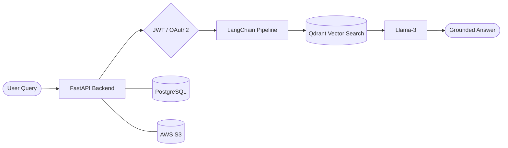
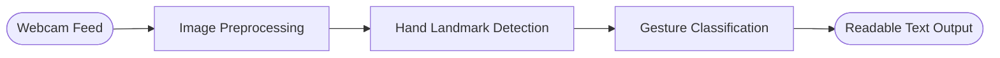

 

 

 

## 👩‍💻 About

Final-year **B.E. Artificial Intelligence & Machine Learning** student who builds AI systems end to end: data and models, APIs, containers and cloud storage. I enjoy turning ML ideas into working, deployable products.

<table>
<tr>
<td width="50%" valign="top">

**🔭 What I'm building**
- LLM applications powered by RAG
- Real-time computer vision systems
- Production-style backends for ML

</td>
<td width="50%" valign="top">

**📈 What I'm strengthening**
- Data Structures & Algorithms
- Deep Learning and NLP
- Cloud and MLOps practices

</td>
</tr>
</table>

 

## 🚀 Featured Projects

### 🏥 Hospital Information Assistant
> A production-oriented hospital information system with an AI chatbot that answers queries using retrieval-augmented generation.

- **Backend:** FastAPI with PostgreSQL and secure JWT/OAuth2 authentication
- **AI layer:** LangChain and Llama-3 with RAG over Qdrant vector search
- **Infrastructure:** Dockerized with Docker Compose; AWS S3 for cloud file storage

 

### 🤟 SignSpeak AI: Real-Time Sign Language Detection
> A webcam-based system that recognizes hand gestures in real time and converts them into readable text. Built by a team of four.

- **Vision pipeline:** preprocessing, hand landmark detection and gesture classification
- **Output:** detected gestures converted to text on screen, live

 

## 🧰 Tech Stack

<table>
<tr>
<td width="180"><b>Languages</b></td>
<td>

</td>
</tr>
<tr>
<td><b>Machine Learning</b></td>
<td>

</td>
</tr>
<tr>
<td><b>Generative AI</b></td>
<td>

</td>
</tr>
<tr>
<td><b>Backend</b></td>
<td>

</td>
</tr>
<tr>
<td><b>Data & Storage</b></td>
<td>

</td>
</tr>
<tr>
<td><b>Cloud & DevOps</b></td>
<td>

</td>
</tr>
<tr>
<td><b>Tools</b></td>
<td>

</td>
</tr>
</table>

 

## 📊 GitHub Activity

 

## 🎯 Roadmap

- [x] Build a RAG-based LLM application with a secure backend
- [x] Build a real-time computer vision system
- [ ] Deepen Deep Learning and NLP through new projects
- [ ] Strengthen DSA and problem solving
- [ ] Grow cloud and MLOps skills
- [ ] Secure an AI/ML internship and contribute to real products

 

## 📫 Let's Connect

I'm open to **AI/ML internships** and collaborations on practical AI projects.

